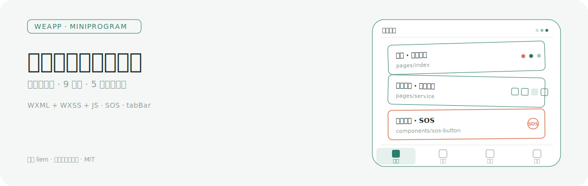
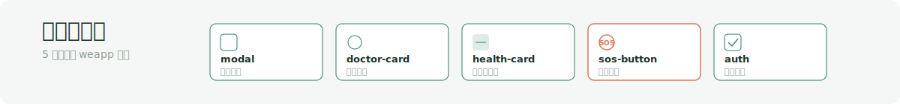
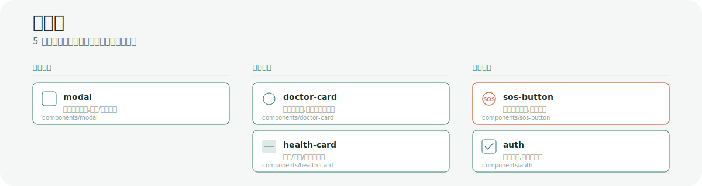
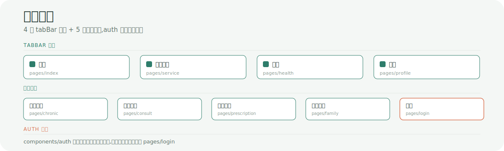
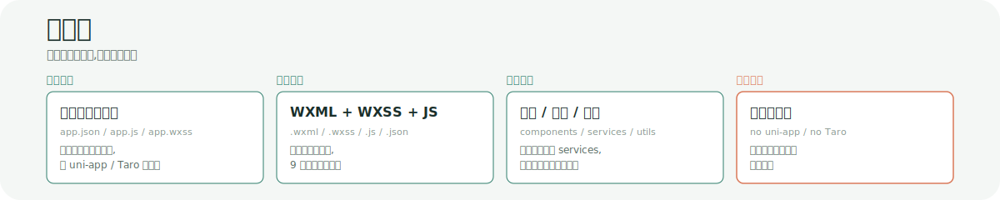
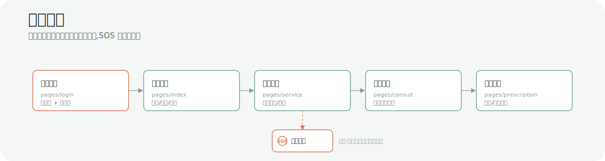
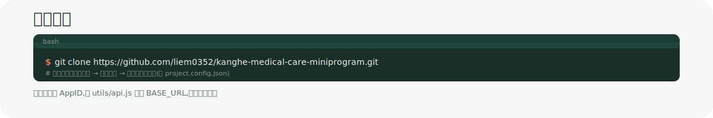

<p align="center">
  
</p>

# 康禾医养微信小程序

为老年人、慢性病患者及其家庭提供健康管理与医疗服务的**原生微信小程序**:首页健康概览、上门护理、慢病跟踪、家庭关怀与一键 SOS 紧急求助,构建在一个微信小程序工程内。

---

## 证明:9 个页面 + 5 个自定义组件

下列路径均来自本仓库 `pages/` 与 `components/` 目录,是小程序原生结构真实落地,而非 mockup。

### 9 个页面模块

| 模块 | 路径 | 说明 |
| --- | --- | --- |
| 首页 | `pages/index` | 健康概览(心率/血压/血氧)、快捷服务入口、今日提醒 |
| 医疗服务 | `pages/service` | 上门护理、康复理疗、心理关怀、专业陪诊 |
| 健康监测 | `pages/health` | 心率/血压/血氧监测、健康评估 |
| 慢病管理 | `pages/chronic` | 慢性病记录、用药记录、病情跟踪 |
| 在线咨询 | `pages/consult` | 图文咨询、咨询记录 |
| 用药管理 | `pages/prescription` | 处方查看、用药提醒 |
| 家庭管理 | `pages/family` | 家庭成员、健康动态、为家人设置提醒 |
| 个人中心 | `pages/profile` | 用户信息、登录认证、紧急求助 |
| 登录 | `pages/login` | 手机号登录、验证码登录 |

### 5 个自定义组件

<p align="center">
  
</p>

| 组件 | 路径 | 用途 |
| --- | --- | --- |
| `modal` | `components/modal` | 通用弹窗容器,统一确认/取消交互 |
| `doctor-card` | `components/doctor-card` | 医生信息卡片,服务与咨询复用 |
| `health-card` | `components/health-card` | 心率/血压/血氧指标卡,首页与监测页复用 |
| `sos-button` | `components/sos-button` | 紧急求助按钮,赤陶强调色突出 |
| `auth` | `components/auth` | 鉴权拦截组件,未登录跳转登录页 |

5 个组件按职责分为容器、卡片、交互三类,跨页面复用以降低重复 UI 成本。

<p align="center">
  
</p>

---

## 工作原理:页面架构与分层

<p align="center">
  
</p>

4 个 tabBar 页面(首页 / 医疗服务 / 健康 / 我的)作为入口,5 个二级页面(慢病管理 / 在线咨询 / 用药管理 / 家庭管理 / 登录)通过页面跳转进入。`components/auth` 在需要登录的页面外层包一层,统一拦截未授权访问。

```
康禾医养/
├── app.js                 小程序入口(全局逻辑、登录态、globalData)
├── app.json               全局配置(pages 注册顺序、tabBar、window)
├── app.wxss               全局样式(松绿健康色、赤陶 SOS 强调色)
├── project.config.json    微信开发者工具项目配置
│
├── pages/                 9 个页面模块(每个含 .wxml/.wxss/.js/.json)
│   ├── index/             首页 · 健康概览
│   ├── service/           医疗服务
│   ├── health/            健康监测
│   ├── chronic/           慢病管理
│   ├── consult/           在线咨询
│   ├── prescription/      用药管理
│   ├── family/            家庭管理
│   ├── profile/           个人中心
│   └── login/             登录
│
├── components/            5 个自定义组件(跨页面复用)
│   ├── modal/             通用弹窗
│   ├── doctor-card/       医生卡片
│   ├── health-card/       健康指标卡
│   ├── sos-button/        紧急求助按钮
│   └── auth/              鉴权拦截
│
├── services/              业务服务层(从页面 JS 抽离)
│   ├── medical.js         医疗服务调度
│   ├── scheduler.js       提醒调度
│   └── sos.js             SOS 紧急求助逻辑
│
├── utils/                 工具层
│   ├── api.js             接口封装(BASE_URL 在此配置)
│   ├── util.js            通用工具
│   ├── validator.js       表单校验
│   ├── locator.js         定位与地图
│   └── encrypt.js         加密
│
└── images/                图片与 tabBar 图标资源
    └── tab-icons/         首页/医疗/健康/我的 四态图标
```

数据流:`页面 WXML 事件` → `页面 JS` → `services/*` 业务编排 → `utils/api.js` 网络请求 → 渲染回 `components/*` 复用组件。

### 技术栈

<p align="center">
  
</p>

- **原生小程序,非跨端框架**:直接使用微信小程序原生 `app.json` / `pages` / `components`,无 uni-app / Taro 中间层,运行时与微信能力贴合更紧。
- **服务层独立**:`services/medical`、`services/scheduler`、`services/sos` 把业务逻辑从页面 JS 中抽离,页面只负责渲染与事件。
- **SOS 一键紧急求助**:`components/sos-button` + `services/sos.js` 把紧急场景做成组件化能力,而非散落在各页面。

### 用户旅程

<p align="center">
  
</p>

从授权登录到用药管理构成核心路径,SOS 紧急求助作为旁路随时可触发,不依赖主流程位置。

---

## 如何使用

<p align="center">
  
</p>

### 前置要求

- 微信开发者工具(稳定版即可)
- 一个微信小程序 AppID(可在 [微信公众平台](https://mp.weixin.qq.com/) 注册测试号)
- 后端服务地址(用于 `utils/api.js` 的 `BASE_URL`)

### 步骤

1. **克隆仓库**

   ```bash
   git clone https://github.com/liem0352/kanghe-medical-care-miniprogram.git
   ```

2. **导入项目**

   打开微信开发者工具 → 导入项目 → 选择仓库根目录(含 `project.config.json` 的那一层)。

3. **填写 AppID**

   在导入向导中填入你的微信小程序 AppID;若仅有测试号,选择「测试号」即可。

4. **配置后端地址**

   打开 `utils/api.js`,把 `BASE_URL` 改为你自己的后端服务地址:

   ```js
   // utils/api.js
   const BASE_URL = 'https://your-backend.example.com'
   ```

5. **真机预览**

   点击工具栏「预览」→ 生成二维码 → 用微信扫码,在手机上体验首页、医疗服务、健康监测与 SOS 求助。

---

## 配置说明

| 配置项 | 文件 | 说明 |
| --- | --- | --- |
| 后端接口地址 | `utils/api.js` | 修改 `BASE_URL` 常量,所有 `services/*` 共用 |
| 地图与定位 | `utils/locator.js` | 调整定位精度、地图中心点等参数 |
| 底部 tabBar | `app.json` | 4 个 tab:首页 / 医疗服务 / 健康 / 我的,图标位于 `images/tab-icons/` |
| 页面注册顺序 | `app.json` | `pages` 数组首项为小程序启动首页 |
| 项目设置 | `project.config.json` | AppID、ES6 转 ES5、上传压缩等开发者工具选项 |

---

<p align="center">
  
</p>

## License

MIT License,作者 **liem**

> 本项目面向老年人与慢病患者的微信小程序场景,SOS 紧急求助仅作为客户端触发能力,实际救助链路需与本地医疗机构/紧急联系人服务对接。
